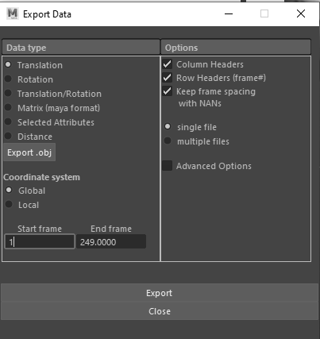
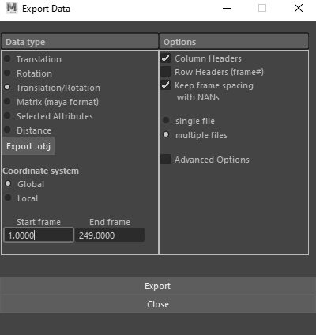

This document describes the format of the different groups of raw data and how they are generated.   
It also describes the data cleaning process (using Data_raw/process.R) to generate the clean data used in the analysis (see "Analyse Cleaned Data" vignette).


```{r, include = FALSE}
knitr::opts_chunk$set(
  collapse = TRUE,
  comment = "#>"
)
```


## Libraries
```{r library, echo=TRUE, message=FALSE, warning=FALSE, eval=TRUE}
library(kableExtra)
devtools::load_all()

```


# Raw Density Data Import 

### **Density data**: Density_data

#### Description

To test the density of the built water tracers, we filmed 19 water tracers droped in a water column. The tracking of their motion over time are stored in the *_tracking.txt files and stored in Density_Data.


# Raw Kinematic Data Import 

## Data exported from Maya
There are two types of raw data, exported from Maya, using the "oRel" and exp" XROMM shelf functions (https://gitbook.brown.edu/xromm/)


### **Waterflow data**: Maya_WF

#### Description

Waterflow data contain the trajectory (time series of tx, ty, and tz) of the food and water tracers of each studied trial. These variables are calculated in Maya as the tracer motions relative to an anatomical coordinate system. See the SMX of the paper to see how the pharyngeal jaws coordinate system has been built in the analysis. The data are generated using the "oRel" function and exported using the "exp" function from the XROMM shelf.

#### XROMM export settings

- Data type: translation
- Coordinate system: global
- Column headers
- Row headers (frame#)
- Keep frame spacing with NANs



#### Format

A single .csv file per trial

- name of the file: C2P2T17_3D_relative_phar.csv
    - C2P2T17 corresponds to the name of the trial
    - phar corresponds to the abbreviation of the anatomical coordinate system used to calculate th relative motion of the tracers in 3D
- number of columns: frames+3*n_tracers
- number of rows: headers + n_frames

### **Rigidbody data**: Maya_RB

#### Description

Rigidbody data contain the 6 degrees of freedom of each rigid body (time series of tx, ty, tz, rx, ry, rz).

#### XROMM exp settings

- Data type: Translation/Rotation
- Coordinate system: global
- Column headers
- Keep frame spacing with NANs



#### Format

A single .csv file per rigid body

- name of the file: C1P1T08_hyoid_data.csv
    - C1P1T08 corresponds to the name of the trial
    - hyoid corresponds to the rigid body name
- number of columns: 3 translations + 3 rotations
- number of rows: headers + n_frames

### **Locator data**: Maya_Loc

#### Description

Locator data contain the 3 degrees of freedom of each locator attached to rigid body and exported from Maya (time series of tx, ty, tz).
The exported locators are:
- tip opercula    
- tip hyoid    
- tip lower jaw    
- tip upper jaw    

#### XROMM exp settings

- Data type: Translation/Rotation
- Coordinate system: global
- Column headers
- Keep frame spacing with NANs


#### Format

A single .csv file per trial 

- name of the file: C1P1T08_BonesLocators_relative_phar
    - C1P1T08 corresponds to the name of the trial
- number of columns: 3 translations x number of locator exported 
- number of rows: headers + n_frames


## Data exported from Videos

The file Sequence.txt is filled with frame numbers corresponding to:

- the beginning of the first strike: **beg_FS**  
- the end of the first trike: **end_FS**  
- the beginning of the first reverse flow: **beg_RF**
- the end of the first reverse flow: **end_RF**  

for each trial.

# Data Process

The imported raw data are processed in the IOFLOWdata package. Here, we give an overview of the data processing. See "R/process.R" for the full code.

## Color palette

A color palette is associated with the IOFLOWdata package

```{r, echo=FALSE, message=FALSE, warnings=FALSE}
plot(x=1:12, col=palette_IOFLOW, pch=21, bg=palette_IOFLOW, main = "IOFLOWdata palette")

```


## Raw Data Import

The raw data are imported and stored in:
  
  * Dentity_Data
  * Maya_WF: "WF" refers to Water Food  
  * Maya_RB: "RB" refers to Rigid Body  
  * Maya_Loc: "Loc" refers to the exported Locators
  * Sequence   
  
The information contained in Maya_RF (frame) and in Sequence are used to build:

  * Timing   

## Data Processing

### Water and Food tracers data 

- Elimination of one prey item over 2 for trials with "P2"

Some trials had two marked food items. As the behavior did not change, one of them was deleted from the dataset to focus on only one.  

#### Trajectory

- Trajectory: Extract all the tx, ty and tz data from Maya_WF  
  
  * WF_tx
  * WF_ty
  * WF_tz

#### Velocity 

- Velocity: Compute the velocity: vx, vy and vz data from Maya_WF
  
  * WF_vx
  * WF_vy
  * WF_vz

#### Mean trajectory

- Mean Trajectory over the Water tracers
  
  * Mean_tx_W 
  * Mean_ty_W 
  * Mean_tz_W 

- Mean Trajectory over the Food tracers
  
  * Mean_tx_F 
  * Mean_ty_F 
  * Mean_tz_F 
  
#### Mean velocity

- Mean Velocity over the Water tracers

  * Mean_vx_W 
  * Mean_vy_W 
  * Mean_vz_W 

- Mean Velocity over the Food tracers
  
  * Mean_vx_F 
  * Mean_vy_F 
  * Mean_vz_F 

## Particle

- tx, ty, tz for each particle of a given trial
